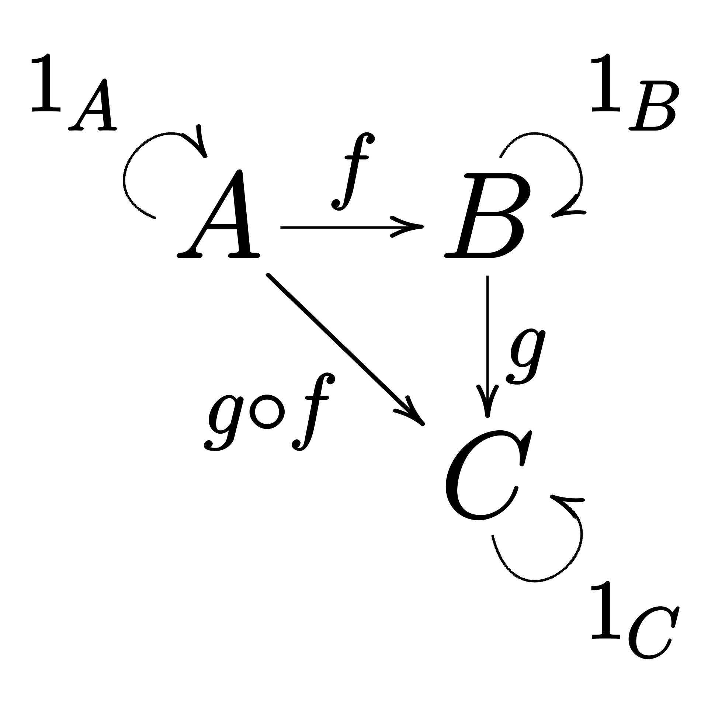
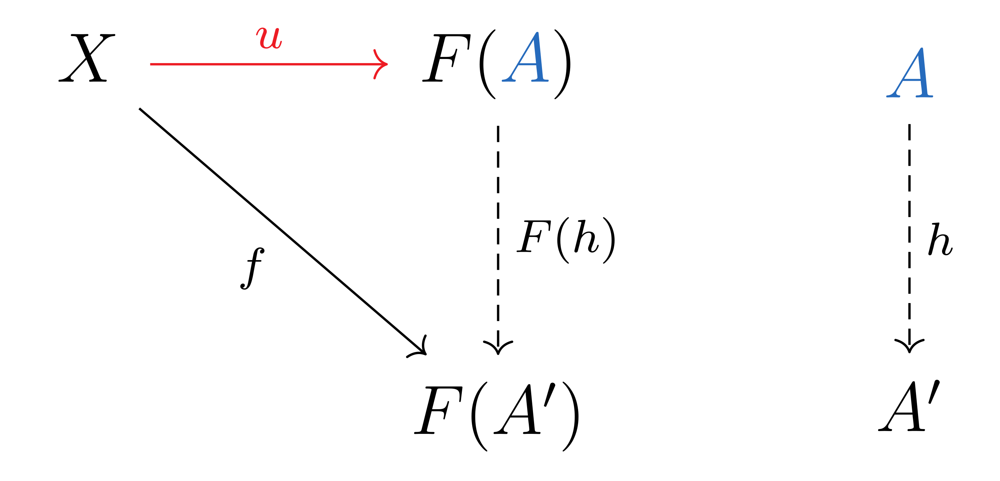
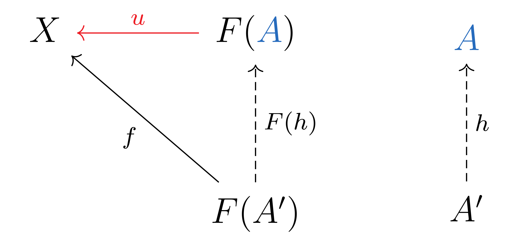
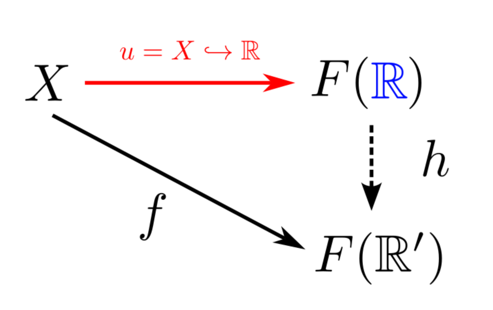
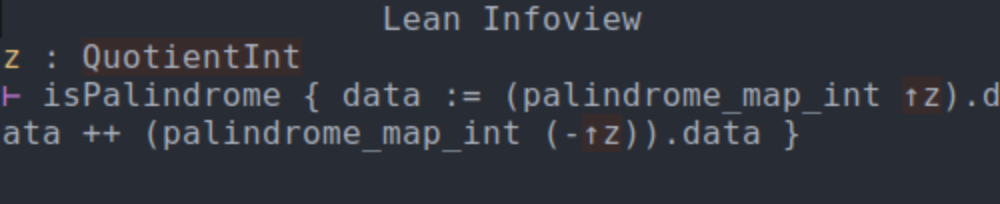
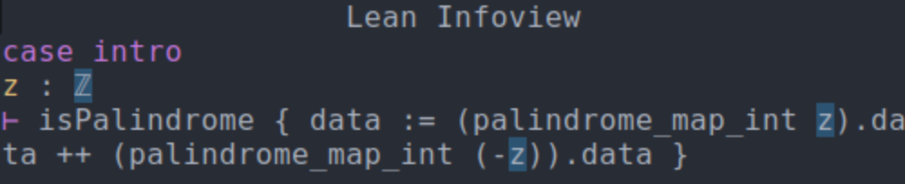

# Morphisms

Author: Ember Chow

## Table of Contents

- [Motivation](#motivation)
- [Aims](#aims)
- [Methods](#methods)
    - [Addressing Aim 1](#addressing-aim-1)
        - [Boolean Example](#boolean-example)
        - [A Category Theoretic View](#a-category-theoretic-view)
        - [Example: Universal Construction of the Reals](#example-universal-construction-of-the-reals)
    - [Addressing Aim 2](#addressing-aim-2)
    - [Addressing Aim 3](#addressing-aim-3)
        - [Part 1: Mutual Coercion](#part-1-mutual-coercion)
        - [Part 2: Isomorphism](#part-2-isomorphism)
        - [Part 3: Lifting](#part-3-lifting)
        - [Part 4: The Recast Tactic](#part-4-the-recast-tactic)
- [Future Work](#future-work)

## Motivation

A central problem in Lean4's ecosystem is the lack of decentralization. The current development philosophy for large parts of Lean4's code is to create pull-requests into Mathlib, which is a "library" made to subsume all of mathematics.

This leads to "dependency lock-in". Higher level code is forced to use implementations made by other authors. Because large parts of the library currently are built on a "as-needed" basis, design decisions suited for one application but not for others may be baked into the core foundation of the library. 

This is completely contrary to the how software development works elsewhere. There are often many implementations that provide the same functionality, and authors can choose from this abundance the library that best suits their design goals.

But this isn't as simple as having two libraries provide, for example, two independent implementations of the integers. What if a theorem proved using library A's framework was not available in library B's framework? It is desirable in this case to be able to "transfer" the prove from framework A to framework B as to not duplicate work.

But going even further on the provided example, how can one even ascertain that:

1. The two librariess actually do provide implementations of the integers.

2. The libraries are equivalent in that any theorem provable in one, is provable in the other.

## Aims

To develop:

1. A proof of concept framework that can distinguish two types as "equivalent" in some sense.

2. A method to use equivalent types interchangeably.

3. A tactic that can transfer proofs quantified over one type to proofs quantified over an equivalent type.

Morever, any such framework or development must be backwards compatible with existing code. There should be no need to make a "Lean 5" or "Mathlib 2" to accomplish this.

## Methods

### Addressing Aim 1

#### Boolean Example

We first specify what we mean when we say that two types are "equivalent". Take for example Mathlib's `Bool` type which models booleans as:

```hs
inductive Bool
| true
| false
```

Another equivalent definition might consider the structure of the the quotient : $\mathbb{Z} / 2\mathbb{Z}$. In this structure every even is equivalent to 0 and every odd is equivalent to 1.

Given *appropriate* definitions of the binary operations "and" and "not", the two types can be said to *model* the booleans. While the two types are not defintionally equal, they are equal in the sense that their behavior under the operations of "and" and "not" are the same. 

In particular, we can form the following function:

$f_{\textrm{Bool} \to \mathbb{Z} / 2\mathbb{Z}}(x) = 
\begin{cases}
0 \textrm{, if False} \\
1 \textrm{, if True}
\end{cases}$

We can further show that:

$f_{\textrm{Bool} \to \mathbb{Z} / 2\mathbb{Z}}(x \wedge y) = 
f_{\textrm{Bool} \to \mathbb{Z} / 2\mathbb{Z}}(x) \wedge 
f_{\textrm{Bool} \to \mathbb{Z} / 2\mathbb{Z}}(y) $

$f_{\textrm{Bool} \to \mathbb{Z} / 2\mathbb{Z}}(\lnot x) = 
\lnot f_{\textrm{Bool} \to \mathbb{Z} / 2\mathbb{Z}}(x)$

That is, the function $f_{\textrm{Bool} \to \mathbb{Z} / 2\mathbb{Z}}$ respects the relationships of "and" and "not". It is easy to see that this function is also a bijection and the inverse also respects "and" and "not". Such an operation is called an *isomorphism* (in the sense of "and" and "not").

This leads to the question: when can we conclude that two types are isomorphic to each other under some set of operations?

#### A Category Theoretic View

Determining when two types are isomorphic can be answered formally via mathematical language of *category theory*. 

**Def. Category:** A set of "objects" and their relationships, called "morphisms". The morphisms must be associtative, and each object must have an identity morphism. 

**Def. Morphisms:** Morphisms generalize the idea of structure preserving maps (homomorphisms for groups, homeomorphisms for topologies, isometries for metric spaces, etc.). 

**Def. Categorical Object:** These can be arbitrary elements and are most often sets; however, they may also be proper classes: the proper class of all sets, the proper class of all rings, the proper class of all topologies, or even the proper class of all categories. In Lean4, each of these are just arbitrary types (in arbitrary universe levels).

These are frequently visualized via "arrow diagrams" (a sample is shown below.)



In particular, category theory provides the concept of a *universal property* which classifies (up to isomorphism) many constructions.

A universal construction is frequently visualized as follows by the following dual diagrams.

Take an object $X$ of some category $\mathcal{C}$ and consider $A, A'$ to be part of category $\mathcal{D}$.

Let $F : \mathcal{C} \to \mathcal{D}$ (a mapping between categories is called a *functor*).

Now we assume that there is a morphism that relates $X$ to $F(A')$. We additionally assume that there is another functor $u : \mathcal{D} \to \mathcal{C}$ that takes X to $F(A)$. If there is a morphism between $A$ and $A'$ called $h$ such that composing $F \circ h$ takes $F(A)$ to $F(A')$, the pair $(X, u)$ is said to be a* universal morphism*. We can see in the diagram following the arrows always results in landing at $F(A')$. 

**Def. Commutative Diagram:** When all arrows end at a single destination in a diagram, the diagram is said to commute.

We can visualize this relationship with the diagram below:



There is also a dual concept which can also characterize universal constructions by swapping the order of the arrows so that all arrows end at $X$.



##### Example: Universal Construction of the Reals.

To see this definition in action, consider how we might make a universal construction for $\mathbb{R}$. Let $A = \mathbb{R}$. Take $X$ as some archmedian field and let $u$ be the embedding of $X \hookrightarrow \mathbb{R}$. It can be shown that this embedding is universal.


Let $F : \textrm{CompleteArchField} \to \textrm{ArchField}$ be a forgetful functor that "forgets" the completeness of an object (since complete archimedian fields are themselves archmedian fields).

Consider some other complete archmedian ordered field $\mathbb{R}'$ and a morphism $f$ between X and $F(\mathbb{R}')$. It can be shown there is a unique morphism $h$ between $\mathbb{R}$ and $\mathbb{R}'$ (we leave it out for brevity). We can also see $f = u \circ F \circ h$.

This is shown in the diagram below:



This is a universal construction and shows $\mathbb{R}$ is the unique (up to isomorphism) complete archmedian field. These constraints can be encoded as typeclasses in Lean. Take for example the `BooleanType` typeclass.

```hs
class BinaryType (α : Type*) extends Zero α, One α, Nontrivial α, Fintype α, Insert α (Finset α) where
  elems := {zero, one}
  decidable_eq : DecidableEq α  -- You can't synthesize this at the typeclass level sadly...
  exhaustive : ∀ (x : α), x = zero ∨ x = one

-- Hack.
instance (α : Type*) [B : BinaryType α] : DecidableEq α := by exact B.decidable_eq

class BooleanType (α : Type*) extends BinaryType α, AndOp α, Complement α where
  absorbing : ∀ x : α, zero &&& x = zero
  identity : ∀ x : α, one &&& x = x
  not_identity : ∀ x : α, ~~~x ≠ x
  and_assoc : ∀ x y z : α, (x &&& y) &&& z = x &&& (y &&& z)
```

### Addressing Aim 2

Lean already has a mechanism for treating types as other types via *coercion*. Using coercion, it is possible to use a `Nat` where an `Int` is expected. These coercions are user defined and narrow; however, broader coercions can be defined for all instances of a typeclass.

This is formally implemented in `Integers.lean`. One might be tempted to write:

```hs
instance (α β : Type*) [is_int_alpha : IsInteger α] [is_int_alpha : IsInteger β] : Coe β α := _
```

Unfortunately, there are two problems with this direct approach:

1. Lean cannot resolve this coercion as it is too general and can lead to infinite loops of coercion.

2. It is not clear how one might specify how to perform the coercion for arbitrary types.

Mathematically, there is always a canonical isomorphism between these two elements by mapping:

$f(1_α) = 1_β$

$f(0_α) = 0_β$

Other elements can be mapped via recursion:

$f(x_α + 1_α) = f(x_α) + 1_β$.

However, this definition, while constructive, is not computable. Since it relies on recursion, it is not clear how to map arbitrary variables of `α` to `β`. We instead take a pragmatic approach. Generally, coercions are most useful between concrete types, in this case, instances of `IsInteger`.

Since Lean already has a built-in `Int` type, we can just enforce that every instance of `IsInteger` define a coercion to and from `Int`. This leads to the following definition:

```hs
class IsInteger (Z : Type*) extends CommRing Z, LinearOrder Z, IsStrictOrderedRing Z where
  ofNat : ℕ → Z
  intEquiv : Z ≃+*o ℤ
  nonneg_well_ordered : IsWellOrder {z : Z | z ≥ 0} (· < ·)
```

We can then use Lean's coercion system to automatically infer every other coercion: if there a coercion from `α` to `β` and `β` to `γ`, then Lean can infer a coercion from `α` to `γ`.

For integers, Lean asks that you register your type as an instance of `IntCast` rather than define your own coercion to play well with internal machinery. This defines a coercion from `Int` to `Z`

```hs
instance IsIntIntCast (Z : Type*) [is_int : IsInteger Z] : IntCast Z := ⟨ofInt⟩
```

We also wish to be able to coerce in the opposite direction, from `Z` to `Int`. In order to solve the infinite coercion loop, we simply mark instances as `CoeHead`. These are coercions that can only take place at the start of a cercion chain.


```hs
instance (Z : Type*) [is_int : IsInteger Z] : CoeHead Z Int := ⟨toInt⟩
```

### Addressing Aim 3

#### Part 1: Mutual Coercion

Note when addressing Aim 2, we set a canonical instance for a typeclass and allowed every instance of a specific typeclass to be coerced to and from that canonical instance (in our example, `Int`).

Lean's coercion inference then made any two typeinstances of `IsInt` enjoy a *mutually coercive relationship*, which I will refer to as a *toxic relationship* between two types.

This allows both types to be used interchangably (even within the same expression). Functions quantified over one instance of `IsInt` can be similarly used for any other instance due to this toxic relationship.

#### Part 2: Isomorphism

The coercions in `IsInteger` and `BooleanType` are carefully defined to be an *isomorphism* between two types. Isomorphism not only map between seperate types, but preserve their algebraic structure. The integer coercion respects addition and multiplication. The boolean coercion respects the "not" and "and" operations.

This allows for whole expressions' types to be converted.

For example since addition is respected: `((a + b) : α) = (a : α) + (b : α)`

#### Part 3: Lifting 

It remains to convert the types of variables. This is possible using Lean's `lift` tactic (though it was not originally designed for this purpose). To show that a type can be lifted to another type, we must register an instance of `CanLift`.

We show the example below from `Integers.lean`. The first argument is the function that performs the lift, and the second argument specifies when a lift is possible. For types with a toxic relationship, this is always possible.

```hs
instance (α β : Type*) [IsInteger α] [IsInteger β] : CanLift β α (fun a ↦ (a : β)) (fun _ ↦ True) where
  prf := by
    intro b
    simp only [forall_const]
    use (b : α)
    simp only [intCast_ofInt, ofInt_intCast]
```

#### Part 4: The recast tactic

It is now possible to define a tactic that makes use of `lift` to iteratively change all occurances of one type to an equivalent type. The resulting expression is simplified using isomorphism lemmas. 

```hs
def recast_tac (src tgt : Syntax) : TacticM Unit := do
  let srcExpr ← elabTerm src none
  let tgtTerm : TSyntax `term := ⟨tgt⟩

  let ctx ← getLCtx

  evalTactic (← `(tactic| try rw [eqCast $tgtTerm]))

  -- Lift each variable of the source type to the target type
  for decl_option in ctx.decls do
    match decl_option with
    | some decl =>
      if ←Meta.isDefEq decl.type srcExpr then
        evalTactic (← `(tactic| lift $(mkIdent decl.userName) to $tgtTerm using (by trivial)))
    | none => continue

  -- The final version of this tactic should use metaprogramming to see which simplifications can be used.
  evalTactic (← `(tactic| simp only[map_mul, map_add, OrderRingIso.map_le_map_iff', ofInt_intCast, ofInt_intCast, intCast_ofInt, intCastInt]))


elab "recast" src:term "as" tgt:term : tactic => do
  recast_tac src tgt
```

An example of this tactic is now shown below:

We create a function that takes in an `Int` and produces a word based on the remainder mod 10. Negative inputs reverse the input. It is clear that concating the string of a number x with -x produces a palindrome (a string that is the invariant under reversion).

We wish to convert this theorem statement to another type:

```hs
theorem neg_concat_isPalindrome (z : ℤ) : isPalindrome (String.mk ((palindrome_map_int z).data ++ (palindrome_map_int (-z)).data)) := by
  unfold isPalindrome

  match h : z with
  | Int.ofNat n =>
    match n with
    | Nat.zero =>
      unfold palindrome_map_int
      simp only [Nat.zero_eq, palindrome_map_zero, Int.ofNat_eq_coe, CharP.cast_eq_zero, neg_zero,
        List.append_nil, List.reverse_nil]
    | Nat.succ n =>
      unfold palindrome_map_int
      simp only[←Int.negOfNat_eq, Int.negOfNat, List.reverse_append, List.reverse_reverse]
  | Int.negSucc n =>
    match n with
    | Nat.zero =>
      unfold palindrome_map_int
      simp only [Nat.zero_eq, Nat.succ_eq_add_one, zero_add, Int.reduceNegSucc, neg_neg,
        List.reverse_append, List.reverse_reverse]
      --simp only[List.reverse_append, List.reverse_reverse]
    | Nat.succ n =>
      unfold palindrome_map_int
      simp
      norm_cast
```

Once the type is converted, the expression exactly matches the existing theorem and it is proven by transfer. This example illustrates both the interchange of equivalent types and the transfer of existing theorems.

```hs
example (z : QuotientInt) : isPalindrome (String.mk ((palindrome_map_int z).data ++ (palindrome_map_int (-z)).data)) := by
  recast QuotientInt as ℤ
  exact neg_concat_isPalindrome z

```

The resulting change in the context before and after the tactic is shown below:







### Future work

The recast tactic shown is a proof-of-concept. It only works for (ordered) ring isomorphisms. It would be ideal to incorporate tactics like `push_cast` (as in `zify` and friends) and perform custom simplification based on annotated simplification lemmas (`zify` simps use the `@[zify]` annotation). This would increase flexibility to arbitrary types and algebraic structure.

Furthermore, `lift` is not the ideal tool for type casting. All uses of the tactic generate subcases that pollute the infoview (since the proof of ability to `lift` is trivial). A simplified version of `lift` might be possible that requires no proof for types with a toxic relationship.